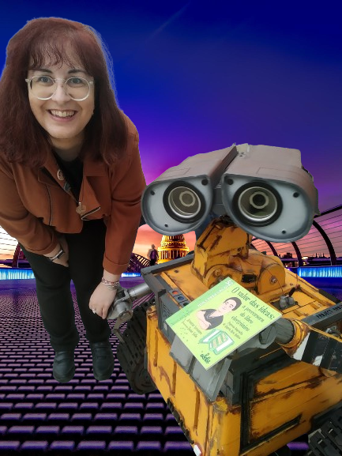

<!DOCTYPE html>
<html lang="es">
    <header>
<body>
    <header class="page-header">
  <h1 class="project-name"><a href="/prog1/">O libro mecánico</a></h1>
  <h2 class="project-tagline">Páxina oficial da pequena biografía de Ángela Ruíz Robles</h2>
</header>
   </body>
</html> 

A idea deste libro parte da necesidade de poñer en valor
as cualidades e traxectoria de mulleres **STEAM** que foron pioneiras no seu eido.
Este exemplar contén máis que unha breve biografía ilustrada por Tania Solla e editada por Lela Edicións.
Podedes atopar nela:
- Unha versión interactiva do libro mecánico
- Un mapa onde podedes debuxar a vosa idea dun libro mecánico do futuro
- Vocabulario de interese e referencias bibliográficas
- Un xogo feito con Python que podedes descargar dende o repositorio de Github: https://www.github.com/libromecanico
- Unha unidade didáctica para poder traballar sobre a autora: https://tinyurl.com/libromecanico

Ademáis tamén podedes interactuar coa autora a través da conta de Twitter: **@libromecanico**

Como diría Ángela Ruiz Robles:

>Venimos a este mundo no solo a vivir nuestra vida lo más cómodo y mejor posible, sino a preocuparnos de los demás, para que puedan beneficiarse de algo ofrecido por nosotros.

